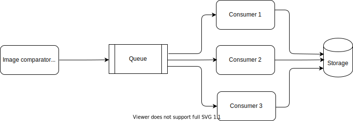

# image_comparator

## Design

## Installation

Docker (Windows, Linux, MacOS)
------

- run ``docker build --tag image_comparator:1.0 .`` to build the image
- run ``docker run -it image_comparator:1.0`` to start the container. It will provide a command line shell inside the container
- run ``docker run -it image_comparator:1.0`` to start the container
- run ``python image_comparator.py images.csv`` to run image comparison on sample images provided in 'images' folder

Virtualenv (Linux, MacOS)
----------

- run ``virtualenv venv`` to create a virtual environment
- run ``source venv/bin/activate`` to start the virtual environment
- run ``pip install -r requirements.txt`` to install all requirements
- run ``python image_comparator.py images.csv`` to run image comparison on sample images (provided in 'images' folder)

Output
-----

The results can be found inside 'results' folder. 

- The name of the output file is in the format output-<timestamp>.csv (for eg: output-1589203893333.csv)
- It is a csv file with 4 columns "image_1", "image_2", "similar", "elapsed" in the same order

How to use this for your own images
------

Copy your images to the 'images' folder. Edit 'images.csv', leave the header and edit the rows to add images to compare. A few things to consider:

- In 'images.csv', use 'images/' prefix with all image paths. It is relative path since images are inside 'images' folder.
- Absolute paths would work too. But these would be different when running on your host machine and inside the docker container (working directory inside docker container is '/usr/src/app').  
- You can use a different folder to save images and a different name for the input csv file. The csv file should have the 2 headers (image1, image2). If using docker container, you will need to update the 'Dockerfile' to copy the new folder and new csv file into the container.
- If using docker, everytime a change is made, you will need to rebuild the docker image before running (``docker build --tag image_comparator:1.0 .``) 
- Syntax to run the program is ``python image_comparator.py <image_csv_file>``
